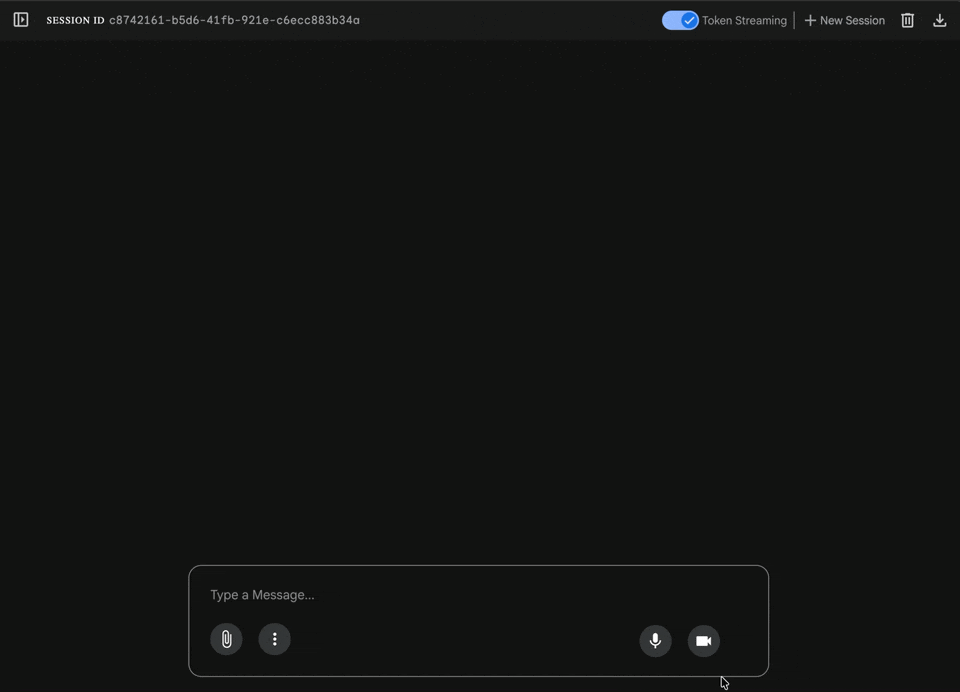

# Ryder Cup Prediction Agent

A multi-agent system powered by Google ADK and Model Context Protocol (MCP) that predicts Ryder Cup match outcomes using True Strokes Gained (TSG) data.



## Architecture

The system uses a **Sequential Agent Pipeline** with 5 specialized sub-agents:

1. **PlayerProfilerAgent** - Fetches TSG data via MCP tools
2. **RecentFormAnalyst** - Analyzes 3-month form trends
3. **BaselineSkillAnalyst** - Evaluates 2-year baseline skill
4. **MatchupSynthesizerAgent** - Synthesizes probabilities from form + skill
5. **MonteCarloSimulationAgent** - Generates match outcomes

All agents communicate via `session.state` using `output_key` parameters.

## Prerequisites

- Python 3.11+
- Google API Key (for Gemini models)
- AgentOps API Key (optional, for tracing)

## Installation

```bash
# Install dependencies
uv sync

# Create .env file from example
cp .env.example .env
# Then edit .env and add your API keys
```

## Usage

### Option 1: CLI Execution

Run the full agent system with MCP data access:

```bash
python run_prediction.py
```

This executes the agent with MCP tools automatically managed via `MCPToolset`. The MCP server is spawned as a subprocess and communicates via stdio.

### Option 2: ADK Web UI (Recommended)

Launch the interactive web interface:

```bash
adk web
```

Then open the URL shown in your terminal (typically http://127.0.0.1:8000).

The `adk web` interface automatically:
- Discovers the `root_agent` from the `ryder_cup_prediction` package
- Spawns the MCP server as a subprocess
- Manages the MCP server lifecycle (start/stop)
- Provides an interactive chat interface

## MCP Integration

The agent uses `MCPToolset` with stdio connection to automatically spawn and manage the DataGolf MCP server:

```python
# In ryder_cup_prediction/agent.py
mcp_server_config = StdioServerParameters(
    command=sys.executable,
    args=[mcp_script_path]
)

mcp_connection_config = StdioConnectionParams(
    server_params=mcp_server_config,
    timeout=10
)

managed_mcp_tools = MCPToolset(
    connection_params=mcp_connection_config
)
```

**No manual server management needed!** The ADK runner handles the entire MCP server lifecycle automatically.

## Project Structure

```
.
├── ryder_cup_prediction/
│   ├── __init__.py                 # Exports root_agent for adk web
│   ├── agent.py                    # Agent with MCPToolset configuration
│   └── sub_agent_definitions.py   # Agent prompts and configs
├── mcp_servers/
│   └── datagolf_server.py          # FastMCP server with TSG data
├── run_prediction.py               # CLI entry point
└── .env                            # Environment variables
```

## Key Features

- **Automatic MCP Management**: MCP server spawned as subprocess via `MCPToolset`
- **Stdio Communication**: Reliable local communication between agent and MCP server
- **Sequential Pipeline**: Agents execute in order, sharing state via `session.state`
- **AgentOps Tracing**: Optional LLM observability
- **ADK Web UI**: Interactive chat interface with full MCP tool support

## How It Works

When you run `adk web` or `python run_prediction.py`:

1. The ADK runner loads `root_agent` from `ryder_cup_prediction`
2. It sees the `MCPToolset` configuration in the agent
3. It automatically spawns `mcp_servers/datagolf_server.py` as a subprocess
4. The MCP server communicates via stdio (standard input/output)
5. Tools are discovered and made available to the agent
6. The agent can call `getPlayerTrueStrokesGained` to fetch player data
7. When the session ends, the MCP server is automatically terminated

No manual server management or network configuration required!

## Development

The agent is configured to automatically use MCP tools via `MCPToolset`. The `create_agent()` function still accepts an optional `mcp_tool_wrappers` parameter for backward compatibility, but it's no longer needed:

```python
# The agent now automatically manages MCP tools
root_agent = create_agent()
```

The `MCPToolset` handles tool discovery and execution automatically.
